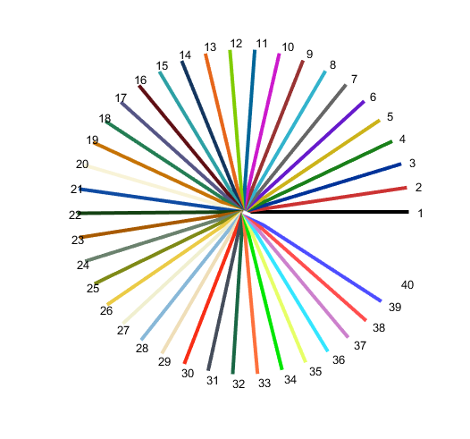
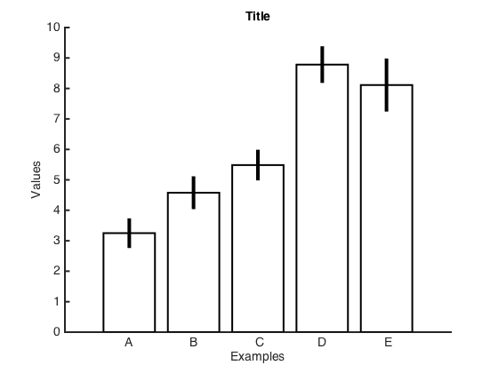
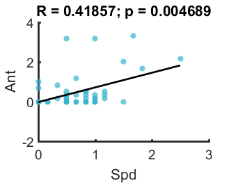
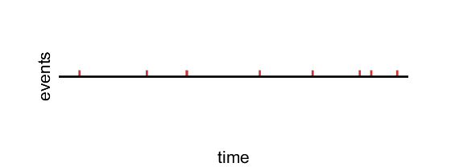
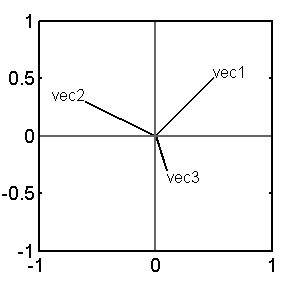
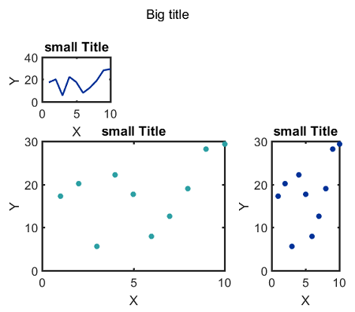

# Making figures: my ploting functions

##### function related to making figures.

## Catalog

Function related to making figures.

### **auto_tick.m**  
calculate tick mark location, used in other functions. 
### **hline.m** 
draw horizontal line
### **mycolor** 
function, pick color from a color plates, used in many plotting functions.
>
  

### **mycorrplot_1**  
Plot the results of correlation (i.e. corr(X)) in a figure with table-like structure.
>

### **mycorrplot_2**  
Plot the results of correlation (i.e. corr(X, Y)) in figures with table-like structure.
>

### [myplot](https://github.com/weitingwlin/matlabutility/blob/master/documents/myplot.md)  
make nice(r) scatterplot or line plot quickly

### [myplot_bar](https://github.com/weitingwlin/matlabutility/blob/master/documents/myplot_bar.md)
make nice(r) barplot quickly

### **myplot_CI**  
make plot to show data and canfidence interval 
>

### [myplot_loglog](https://github.com/weitingwlin/matlabutility/blob/master/documents/myplot_loglog.md)
Make a nice log-log plot, or semi-log plots quickly

### **myplot_ls**  
Make scatter plot and ls line
>
 

### [myplot_point](https://github.com/weitingwlin/matlabutility/blob/master/documents/myplot_point.md)
Plotting point process on a time line
 

### [myplot_vec](https://github.com/weitingwlin/matlabutility/blob/master/documents/myplot_vec.md) 
plotting 2D vector
>
 

### **myplotyy**  
make nice(r) plotyy quickly
>
 

### **mysubplot**  
Make subplot and add major/big title to the figure
>

### **plot_circle**  
eazier way to make a circle
### **plot_square**  
Make a square or box by imput x and y points
