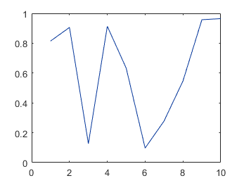
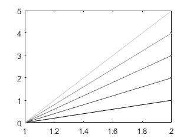
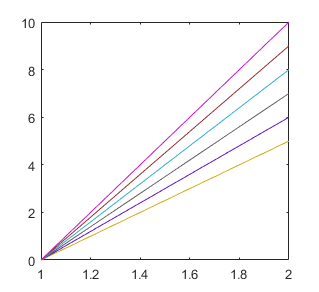

# mycolor

##### This function is a color selecter: generating a 3-number vector code for a color. Can be used in all plotting functions.

#### Use with [_myplot_](https://github.com/weitingwlin/matlabutility/blob/master/documents/myplot.md) 

## Syntax

#### `code = mycolor(colorcode,selectplate)`  
#### `mycolor(0, selectplate)`

#### `mycolor(-1, selectplate)` 

*  **colorcode**: integer (>1), selecting from the color plate: 
  + e.g. colorcode = 3 returns [ 0 0.2000 0.6000], the code for dark blue from the default plate 'color'
  + other usages :     
     * colorcode = 0 (default): will display the color plate assigned in a new figure
     * colorcode = -1 ; return the colormap (3 * ?) matrix, specified in [selectplate]
     * colorcode is a string (passed to selectplate), return colormap (as colorcode = -1);  
* **selectplate**: a string, assign the plate you want to chose from
 +  'color': default; the plate with discrete color; type `mycolor(0)` or `mycolor` for detail
 +  'redblue': a red to blue bipolor scale; type `mycolor(0,'redblue')` for detal
 +  'gray': a gray scale; type `mycolor(0,'redblue')` for detail

## Examples: use in plot function

     plot([1:10], rand(1,10),'color',mycolor(3))
         

## Example: to display color plate

Display the default color map ( equals to `mycolor(0,'color')` or `mycolor(0)`)

    mycolor   
     
Display the red-blue color map
 
    mycolor(0,'redblue')
  

## Example: return colormap

Return the gray colormap
	
	cmap = mycolor('gray');
    	for i = 1:5
        	plot([1 2],[0 i],'color',cmap(i,:)); hold on
    	end

 
 
Return the default colormap ( equals to `mycolor('color')` or  `mycolor(-1,'color')` )
	
	cmap = mycolor(-1);
    	for i = 5:10
        	plot([1 2],[0 i],'color',cmap(i,:)); hold on
    	end

  