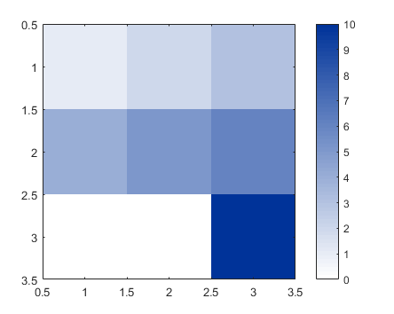
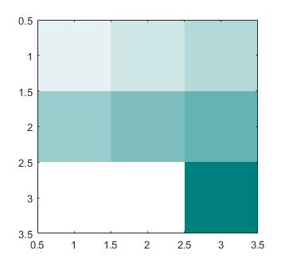
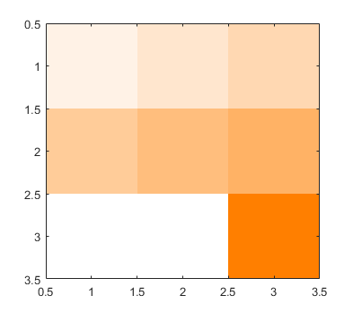

# mycolormap

##### Making colormap from `mycolor` or input rgb code

 Depends on: [mycolor](https://github.com/weitingwlin/matlabutility/blob/master/documents/mycolor.md)

## Syntax

###  mymap = mycolormap(c);

*  **c**: the color of the full scale
   + Vector (length = 3), RGB tripletcode for colors. 
   + Or an interger, select a color from mycolors. (To see color plate, type mycolor, or check the document.)
   + or one of the strings:  'red', 'green', 'blue', 'purple', 'teal', 'olive', 'orange'  
* **mymap**: a matrix of size 64 * 3, can be used as a [`colormap`](https://www.mathworks.com/help/matlab/ref/colormap.html)        

  

## Example: 
#### Specify the full scale color: from `mycolor`

	   A = [1 2 3 ; 4 5 6; 0 0 10]
       imagesc(A)
       colormap(mycolormap(3)); colorbar 

   

#### Specify the full scale color by name
       colormap(mycolormap('teal'));

   

#### Specify the full scale color by RGB code
       colormap(mycolormap([1 0.5 0]))
        % this is equal to
        %   colormap(mycolormap('orange'));

   
