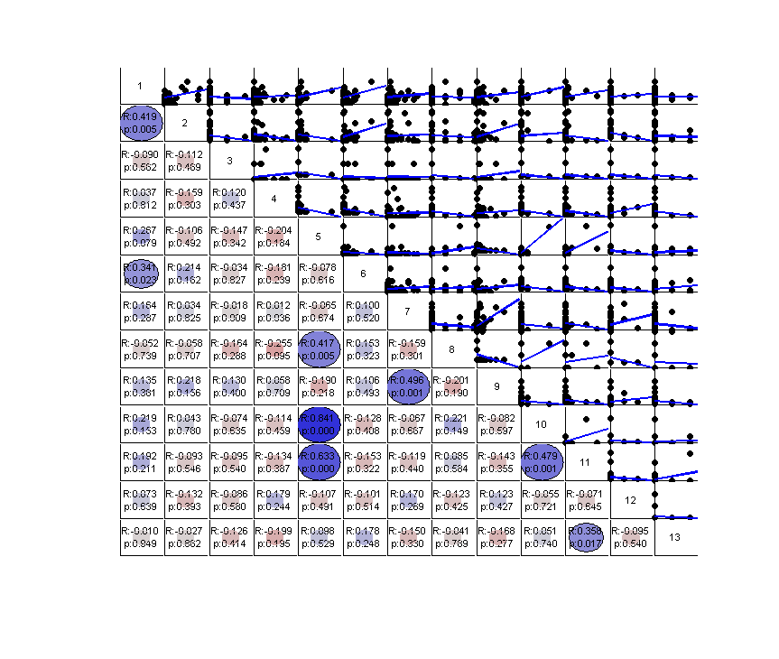
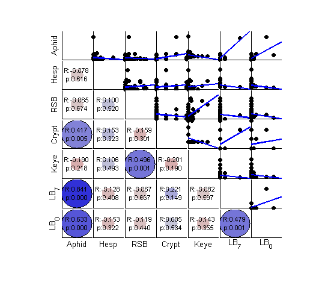
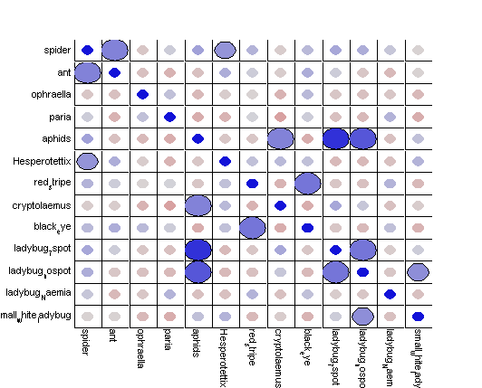
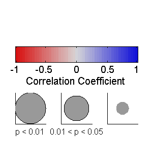
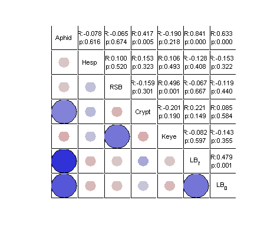

# mycorrplot_1

##### This function should present the result of correlations in a figure with table-like structure. Visualize the result of: corr(X)

##### Rows with NaN will be removed for each pair of variables. Input can be matriX or table. 

##### R values and Significance levels (range of P values) are visualized as the color and sizes of circle. User can also chose to see scatterplots, and/or text with R and P values on one triangle.

#### Inspired by : 
* corrplot : from Matlab econometrics tool box
* [correlationCircles](http://www.mathworks.com/matlabcentral/fileexchange/45698-correlation-circles) by David Legland
* R package [corrplot](http://cran.r-project.org/web/packages/corrplot/vignettes/corrplot-intro.html)

#### Depend on :
* Matlab Statistics and Machine Learning Toolbox
* my functions: **plot_circle.m**, **mycolor.m**, **nancorr.m**, **tnames.m**

## Syntax

### mycorrplot_1( X, xnames, type, colorbaron, textin)

* **X** : data, can be a matrix or a table. We are interested in correlation between each pair of columns in X; as in corr(X)
* **xnames** : optional. Cell array of strings; name of each column in X; default is {'1','2','3',....}; if input **X** is a table, default is the variable names in **X**. 
* **type** : style of output, can be 'C','T','S','B'; default is 'B'
 + 'C' :'circles' on both upper and lower tringles
 + 'T' :'text': text on the upper triangle, circle on the lower triangle
 + 'S' : 'scatter plot' on the upper triangle, circle on the lower triangle
 + 'B' : ("both") circle and text on the lower triangle, scatterplot on the upper.
* **colorbaron** : 0 or 1; whether to plot out the legend or not; default is 0
* **textin** : 0 or 1; whether to put labels in the diagnal; default is 1 if xnames not specified, 0 otherwise

## Examples

Load data

     load ./X_data/X_community
     shortnames = {'Spd','Ant','Ophr','Paria','Aphid','Hesp','RSB','Crypt','Keye','LB_7','LB_0','LB_n','LB_sw'}

Make data into a table
     
      Tdata = array2table(insect_data,'VariableNames',shortnames);
      Tdata(1:3,:)  % display the first few line

###Examples of usage: default

    mycorrplot_1(insect_data)
    
Equal to mycorrplot\_1( insect\_data, {'1','2','3',....,'13'}, 'B', 0, 1 )

  

###Examples: working with table
If input is a table, variable names will be carried in.

    mycorrplot_1(Tdata(:,5:11)) % (for smaller plot we use only a subset here)
  

 In this example, variable names are short enough so we could put variables in the diagnal. Use [] as place holder for parameters that you want to use default values.

 **Example**

    mycorrplot_1( Tdata(:,5:11), [] , [], [], 1 ) 
 
###Example of type = 'C'
'C' for 'circles' on both upper and lower tringles. 

    mycorrplot_1(insect_data, insect_names, 'C',1,0) 
 
With colorbaron = 1, the legend will be plotted in a new figure. 

  
  

###Example of type = 'T' 
'T' for 'text': text on the upper triangle, circle on the lower triangle

textin = 1; variable names will be put in the diagonal boxes.

    mycorrplot_1(Tdata(:,5:11),[], 'T',0,1)

  

###Example of type = 'S'  
'S' for 'scatterplot': scatter plot on the upper triangle, circle on the lower triangle

    mycorrplot_1(Tdata(:,5:11),[] ,'S',0,1)  
 

###Example: dealing with NaN 
NaN will be removed for each varialble pair.

To demo, create a mock data with NaNs:
    
    nandata = Tdata(1:20,5:11);  
    nandata{[1 2],3} = NaN; nandata{7,4:6} = NaN;

A message will apear in command window if data includes NaN

    mycorrplot_1(nandata, [] ,'S',[],1) 

##### NaN removed before calculating correlation; see nancorr.m for detail