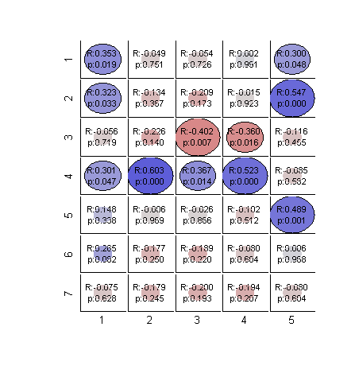
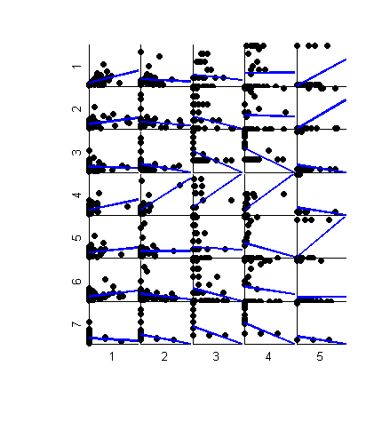
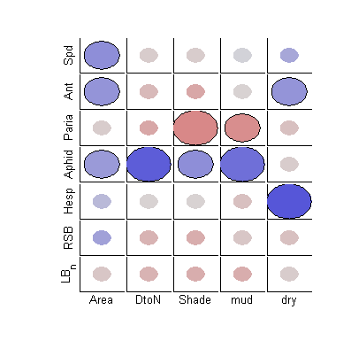
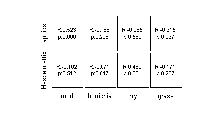

# mycorrplot_2

##### This function should present the result of correlations in a figure with table-like structure. Visualize the result of: corr(X,Y)

##### Rows with NaN will be removed for each pair of variables. Input can be matrices or tables. 

##### R values and Significance levels (range of P values) are visualized as the color and sizes of circle. User can also chose to see scatterplots, and/or text with R and P values on one triangle.

#### Inspired by : 
* corrplot : from Matlab econometrics tool box
* [correlationCircles](http://www.mathworks.com/matlabcentral/fileexchange/45698-correlation-circles) by David Legland
* R package [corrplot](http://cran.r-project.org/web/packages/corrplot/vignettes/corrplot-intro.html)

#### Depend on :
* Matlab Statistics and Machine Learning Toolbox
* my functions: **plot_circle.m**, **mycolor.m**, **nancorr.m**, **tnames.m**

## Syntax

### mycorrplot_2(X, Y, xnames, ynames, type, plotson)
 * **X, Y**: data; X and Y should have the same number of rows; we are interested in correlation between each column of X and each column of Y.
 as in corr(X,Y)
 * **xnames, ynames** : name of each column in X and Y, stored in cell array of strings; default is {'1','2','3',....};  if input **X** and **Y** are table, default is the variable names. 

* **type** :  style of output, can be 
  + 'C' (for circle),
  + 'T' (for text),
  + 'B' (for both), the default. 

* **plotson**: a  vector of 3 numbers,0 or 1, indicate whether each plot will be made. Default: [1 0 0]
  + plotson(1): the main plot with R and p values
  + plotson(2): the scatterplots with LS line
  + plotson(3): the color bar for the circles

## Examples

Load data

     load ./X_data/X_community

Give variable short names: The names in insect_names can be too long for some display, so I create a short version of names 

	shortnames ={'Spd','Ant','Ophr','Paria','Aphid','Hesp','RSB','Crypt','Keye','LB_7','LB_0','LB_n','LB_sw'}
	shortnames_met = {'Site','Patch','L','W','Area','H','DtoN','Shade','mud','borr','dry','grass'};

Subsetting : use only some of the original data in later analyses

	set1 = [1 2 4 5 6 7 12];
	set2 = [5  7 8 9 11 ];

Make data into format "table"

	Tdata = array2table(insect_data(:,set1),'VariableNames',shortnames(set1));
		Tdata(1:3,:) % display the first few lines
	Tdatamet =  array2table(patch_met(:,set2),'VariableNames',shortnames_met(set2));
		Tdatamet(1:3,:)

### Examples of usage:  Default; type = 'B'

Default type is 'B', default labels are numbers; default output is to show the correlation result and the scatter plot but not the legend (**plotson** = [1 1 0])

	mycorrplot_2(insect_data(:,set1), patch_met(:,set2))

  

  

### Examples of usage : inputs are table; and type = 'C'
Variable names will be carried in from the tables. 

To set other parameter, use [] as place holder for **xnames** and **ynames**. 

Set **plotson** = [1 0 0], only show the correlation reuslt.

	mycorrplot_2(Tdata,Tdatamet,[],[],'C',[1 0 0])

  

### Examples of usage: type = 'T'
Show a table with R and p values.

	mycorrplot_2(insect_data(:,[5,6]), patch_met(:,[9 10 11 12]),insect_names([5 6]),met_names([9 10 11 12]), 'T',[1 0 0])

  

### Missing data (as NaN)

	% introduce some missing data manually
   	  Tdata{15,1:3}=NaN;
      Tdatamet{[40 43 44], 5}=NaN;

A message will apear in command window if data includes NaN

	mycorrplot_2(Tdata,Tdatamet,[],[],'C',[1 0 0])

##### NaN removed before calculating correlation; see nancorr.m for detail

  