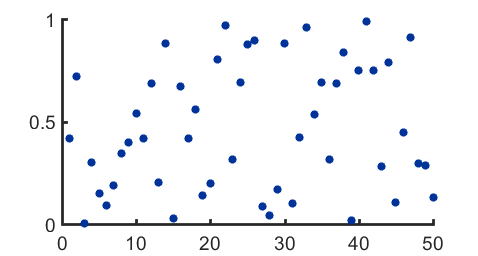
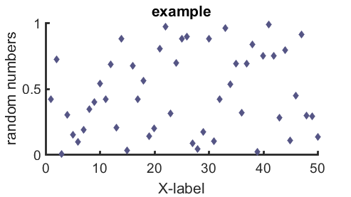
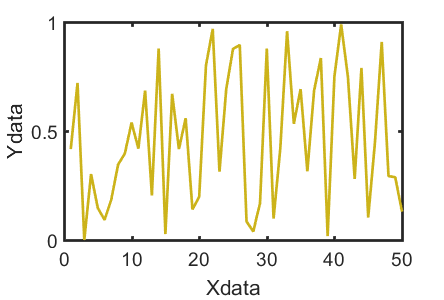
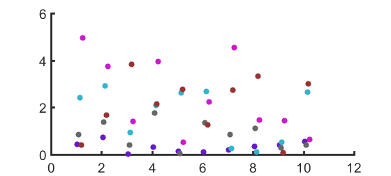
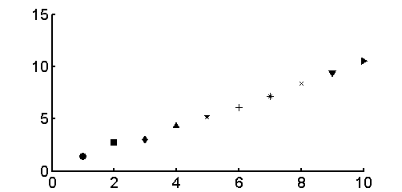
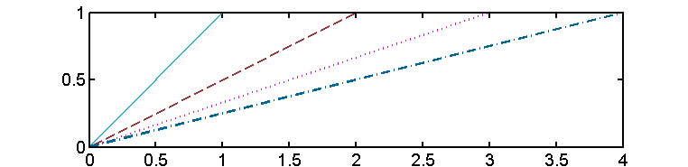
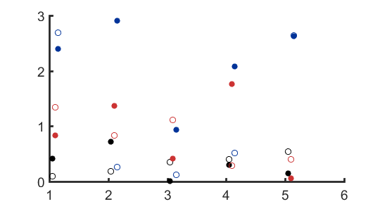

# myplot

##### Make scatter plot or line plot quiickly and nice.

##### Larger font, thicker line/markers, select color from `mycolor`

#### Depends on:
* my matlab utility function [mycolor](https://github.com/weitingwlin/matlabutility/blob/master/documents/mycolor.md) 

## Syntax

### h = myplot( X, Y, type, color, style )

*  **X**,**Y**: vectors of data x,y, numeric or column of table
*  **type**:optional, type of plots 
   + 'S': scaatter plot, the default
   + 'L': line
   + 'B': both
* **color**: optional, color, can ba a number (default is 3, code for dark blue), or a vector of 3
  + IF it is a number, selecter of color from **mycolors**　to see color plate, type `mycolor(0)`, or check document
  + IF it is not round, round part means the color code, 0.5 decimal part means the marker be hollow
  + IF it is a vector, it is the color code
* **style** : line or marker style of corresponding **type**. For type = 'B', apply only to marker.

## Example: simple usage
Make a plot nice and quick:

		x=1:50;
		rng(1); y=rand(1,50);
    myplot(x,y)
   

Set varaibles,change color and style, add title, labels:

    myplot(x,y, 'S' , 17,'d')
		title('example')
		ylabel('random numbers')
		xlabel('X-label')
  

## Example: table input

Create a table:

	T = table(x',y', 'VariableNames', {'Xdata', 'Ydata'});

Use table column as input data, variable names will be carried in as x and y labels.
	
	myplot(T(:,1),T(:,2),'L',5);
  

## Example: usage in a loop

The advantage of using color in `mycolor` is in a **for** loop.

		rng(1); 
	for i = 1:5
    	myplot([1:10]+i*0.05, rand(1,10)*+i, 'S', i+5); hold on
	end
  

Loop usage also apply to **style**: There are 10 types of marker styles.

    rng(1); 
	for i = 1:10
    	myplot(i, rand(1)+i, 'S', 1,i); hold on
	end

  

There are 4 types of line styles.

    rng(1); 
	for i = 1:4
    	myplot([0 i],[0 1], 'L',i+7,i); hold on
	end

  

## Example: usage of n.5 in loop 

With n.5 color code, we can display another dimension of data. 

		rng(1); 
	for i = 1:3    % this variable is displayed in different color
		for j=1:2  % this variable is dispalyed in solid or hollow circle

    		myplot([1:5]+i*0.05, rand(1,5)*+i, 'S', i+(j-1)*0.5); hold on
                                                    % .5 codes for hollow  
		end
	end

  