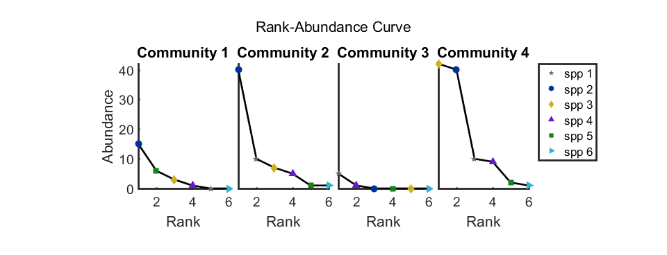
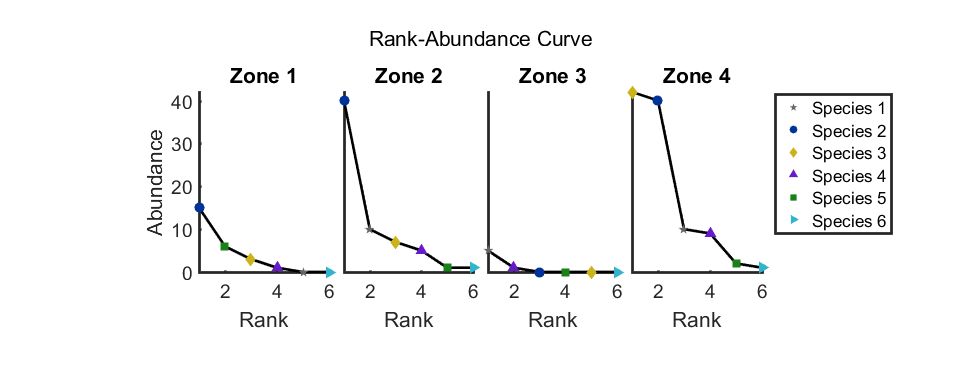
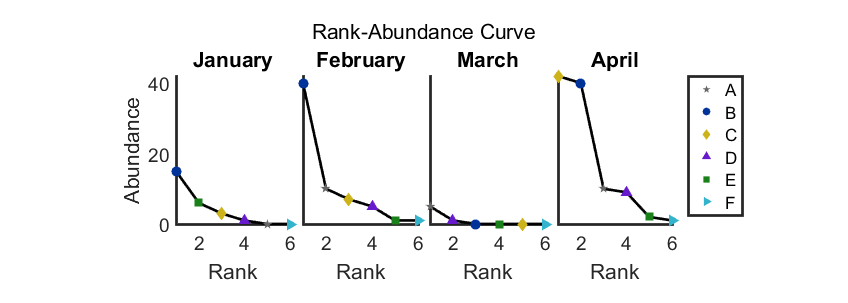
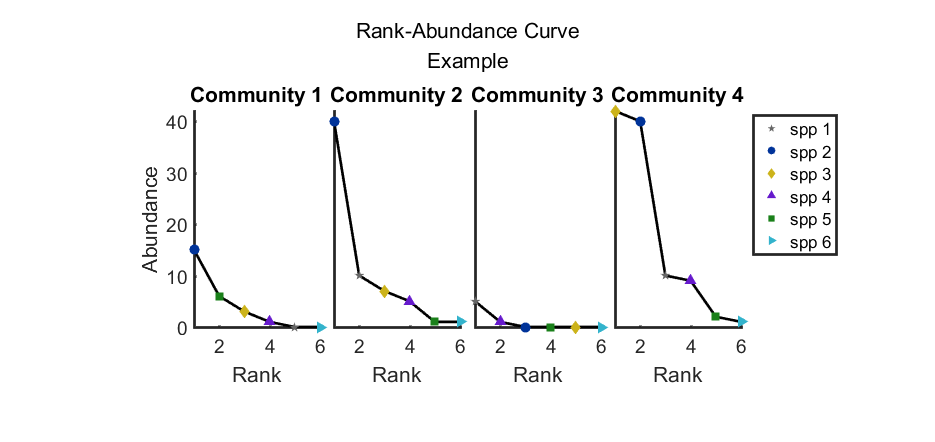
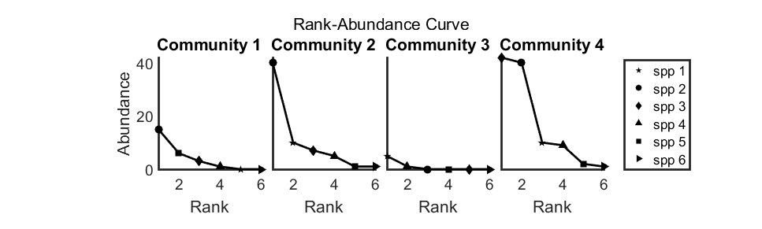
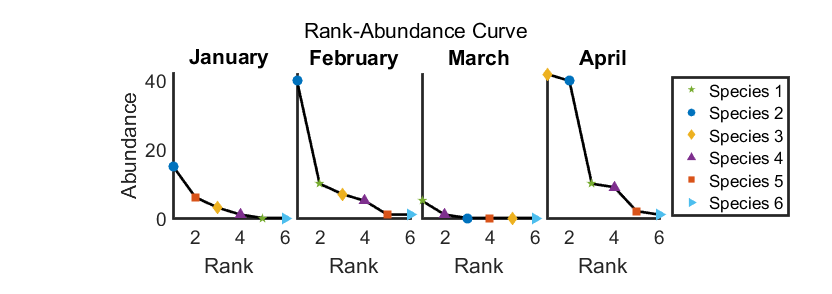
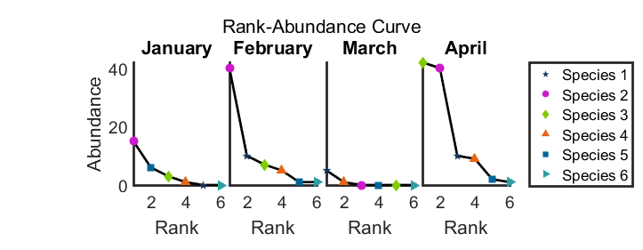
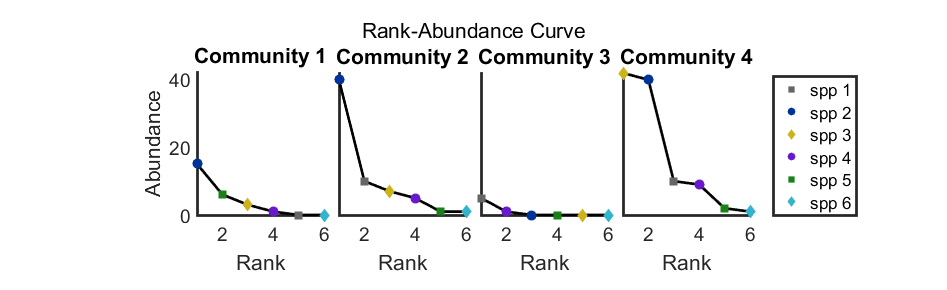

# myplot_RAC 

##### This function plots Rank-Abundance Curve. 

##### (each community well be presented in subplots, so cannot be embeded in subplot)
#### Depends on:
* my matlab utility function [mycolor](https://github.com/weitingwlin/matlabutility/blob/master/documents/mycolor.md), [mysubplot](https://github.com/weitingwlin/matlabutility/blob/master/mfiles/mysubplot.m), [myplot](https://github.com/weitingwlin/matlabutility/blob/master/mfiles/myplot.m) 

## Syntax

### myplot_RAC(X)

### myplot_RAC(X, strs, strn, bigtitle, colorsheet, stylesheet)

*  **X**: matrix of size [n, p] ; for n communities, p species
*  **strs**: optional,  cell array of strings or a string, the name of the "species". Default is {'spp 1', 'spp 2', ...}; will show as legends
   + if is a string: replace the 'spp' in default  
   
* **strn**:  optional,  cell array of strings or a string, , the name of the "communities"; default is {'Community 1', 'Community 2', ...}; will show as title; usage is similar to **strs**.

* **bigtitle** :the bigtitle, deafult is 'Rank-Abundance Curve'  
* **colorsheet** : 3 by p' matrix (p' > p). The color of each Species, ranked in the first row. Can also take index in **mycolor**, see example for detail.    
 + if input is only 1 color, all species will have same color

* **stylesheet** :cell array of string. The style of each Species, ranked in the first row.
  
## Example: 
### Create mock data
Assuming we have a data set of 4 communities (4 rows) with 6 species (6 columns). 

    X = [0 15 3 1 6 0; 10 40 7 5 1 1;   5 0 0 1 0 0; 10 40 42 9 2 1]

### Example: default usage

	myplot_RAC(X);

### Example: specify the string headers

	myplot_RAC(X, 'Species', 'Zone');

So the legends will be : **'Species 1'**, **'Species 2'**, ...; and the titles will be : **'Zone 1'**, **'Zone 2'**, ...

### Example: specify the strings one by one

	myplot_RAC(X, {'A', 'B', 'C', 'D', 'E','F'}, {'January','February','March', 'April'});

( can also  use [num2month](https://github.com/weitingwlin/matlabutility/blob/master/mfiles/num2month.m) ) 

### Example: specify the master title
	
	myplot_RAC(X, [], [] , {'Rank-Abundance Curve', 'Example'});

 (to use default value, put `[]` as placeholder)

### Example: specify the color 
 if input is only one color, all symbols will have the same color

	myplot_RAC(X, [], [], [], [0 0 0]);

 other usages (the 3 commands below produce identical results)

  	 myplot_RAC(X, [], [], [], 'k');
  	 myplot_RAC(X, [], [], [], mycolor(1));
  	 myplot_RAC(X, [], [], [], 1);

(if input is an integer, select the color from `mycolor`)

### Example: specify the colors one by one
 use [matlab built-in colormap](https://www.mathworks.com/help/matlab/ref/colormap.html)

 	temp = lines; 
 	myplot_RAC(X, 'Species', num2month(1:4), [], temp(1:6,:));

 if input is color with length~=3, each number will be treated as color selector from `mycolor`

    myplot_RAC(X, 'Species', num2month(1:4), [], 10:30);

### Example: specify the symbol
 Input symbol will be recycled if not enough

    myplot_RAC(X, [], [], [], [], {'o', 's', 'd'});

 if input is only one symbol, all symbols will have the same style

       myplot_RAC(X, [], [], [], [], 'o');

 Extra symbols will be ignored

       myplot_RAC(X, [], [], [], [], {'o', 's', 'd', 'o', 's', 'd', '^', '<', '>'});

### Example: cannot deal with too many species
    X2 = [1:35; 35:-1:1];
    myplot_RAC(X2);
    
 (will get an error message)