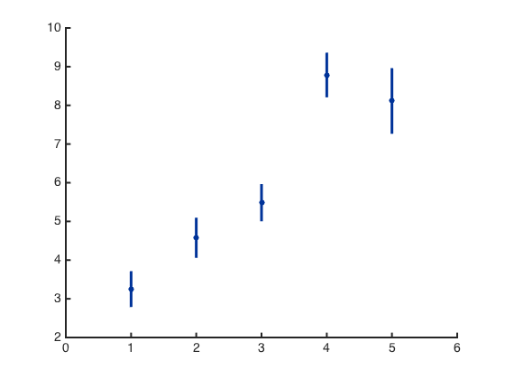
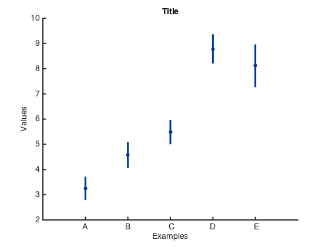
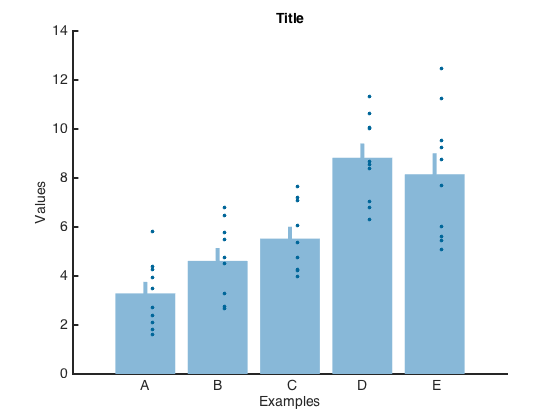

# myplot_bar

##### Making bar graphs, with options to add on error bar (SE, NaN removed) and data points 

#### Depends on:
* my matlab utility function [mycolor](https://github.com/weitingwlin/matlabutility/blob/master/documents/mycolor.md), [myplot](https://github.com/weitingwlin/matlabutility/blob/master/documents/myplot.md), [myplot_errorbar] 

## Syntax

### myplot_bar(data, Styles, Texts)

*  **data**: n x p matrix, each column is a variable, with (at most) n points/replicates. variables with less than n datapoint represented by NaN  
*  **Styles**: a structure, with optional fields to custonmize figure styles.
 + barcolor: Color\* of the frame of the bars. Default is `mycolor(3)`, dark blue.)
 + barfill: Whether or what color\* to fill the bar. 'On' means fill the bar the same color as the frame. Default is [1 1 1], white (or not filled).
 + ebcolor: Error bar color\*.
 + ebhead: Error bar head width. Default is 0 (no horizontal bar head). 
 + pointcolor: Color\* of data point.
 + ErrorOn:  0 or 1; whether to plot bar, default is 1 
 + BarOn: 0 or 1; whether to plot bar, default is 0 (mean value shown as a point)
 + DataPointsOn: whether to plot data points, default is 0
 
*  **Texts**: Texts to put in
 + xlabels: character cell, name of each bar (column)
 + xlabel: 
 + ylabel:
 + title:
 
#####\*color: Vector (length = 3), [RGB tripletcode for colors](http://www.mathworks.com/help/matlab/ref/colorspec.html?searchHighlight=colors). Or an interger, select a color from **mycolors**. (To see color plate, type `mycolor`, or [check the document](https://github.com/weitingwlin/matlabutility/raw/master/documents/images/mycolor_2.png).)

## Example: 
### Create mock data

	temp=rand(10,5);
	MockData = temp.*repmat([5 5 5 8 8],10,1)+repmat([1:5],10,1);

### Use default settings

#### `myplot_bar(data)`

		myplot_bar(MockData);

### Add text to the plot
####  `myplot_bar(data, Styles, Texts)`
 Since **Styles** is the second input, we need a place holder `[]`

 (Note: Not all items in the structure need to be specified.)

    figure
    myStyle = []; % place holder for [Styles]
    mytexts = [];
         MockLabels={'A','B',' C','D', ' E'};
    mytexts.xlabels= MockLabels;% use struct(field, value) for the first element
    mytexts.xlabel = 'Examples';
    mytexts.ylabel = 'Values';
    mytexts.title = 'Title';
    %%%%%%%%%%%%%%%%%%%%%%%
    myplot_bar(MockData, myStyle,mytexts);
    %%%%%%%%%%%%%%%%%%%%%%%
    

###  Change the styles
####  `myplot_bar(data, Styles, Texts)`
This style would be better for publication.

	figure
	myStyle = struct([]);
	myStyle = struct('barcolor', 1);
		% use struct(field, value) for the first element
     	% equal myStyle = struct('barcolor', mycolor(1));
	myStyle.BarOn = 1;
	figure
	%%%%%%%%%%%%%%%%%%%%%%%
	myplot_bar(MockData, myStyle,mytexts);
	%%%%%%%%%%%%%%%%%%%%%%%

	
### More examples
Plot the data point as well as the bar graph. Make a filled bar graph.

	myStyle.DataPointsOn = 1;
	myStyle.barcolor = mycolor(28);
	myStyle.barfill = 'On'; % fill 
	myStyle.pointcolor = 11; 
	% equal to `myStyle.pointcolor = mycolor(11)`
	figure
	%%%%%%%%%%%%%%%%%%%%%%%
	myplot_bar(MockData, myStyle,mytexts);
	%%%%%%%%%%%%%%%%%%%%%%%

	