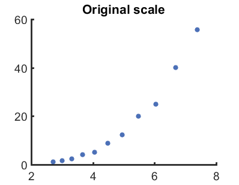
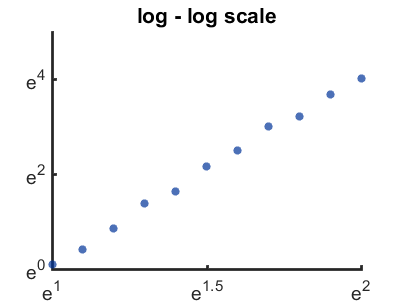
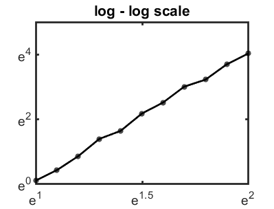
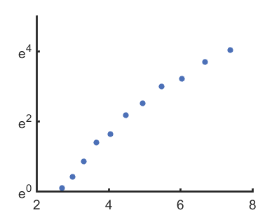
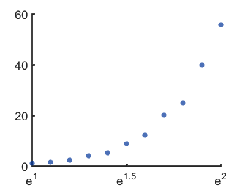
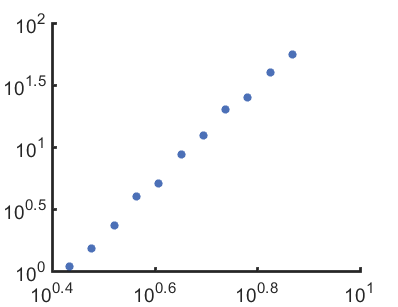

# myplot_loglog 

##### Make a nice log-log plot, or semi-log plots quickly 
 
 Depends on: [auto_tick](https://github.com/weitingwlin/matlabutility/blob/master/mfiles/auto_tick.m), [myplot](https://github.com/weitingwlin/matlabutility/blob/master/documents/myplot.md), [mycolor](https://github.com/weitingwlin/matlabutility/blob/master/documents/mycolor.md), [mystyle](https://github.com/weitingwlin/matlabutility/blob/master/documents/mystyle.md)
## Syntax

###  h = myplot_loglog(X, Y, type, color, style, baseX, baseY)

* **X, Y** :data to be (maybe) transformed and plotted
* **type, color, style** : variables to be passed to function `myplot`
  + **type** : 'S' for scatter, 'L' for line, 'B' for both, [] for default ('S')   
  + **color** :  color code **\***, [ ] for default ( 3 , or darkblue)  
  + **style** : style of line or symbal (e.g. 'o', ':'), [] for deafult
* **baseX, baseY**: base of log transform on data X and Y. Can be 1 (not transformed), 2, e (default), or 10. [] for default (e)

#####\*color: Vector (length = 3), [RGB tripletcode for colors](http://www.mathworks.com/help/matlab/ref/colorspec.html?searchHighlight=colors). Or an interger, select a color from **mycolors**. (To see color plate, type `mycolor`, or [check the document](https://github.com/weitingwlin/matlabutility/raw/master/documents/images/mycolor_2.png).)

## Examples:
#### Make mock data
    X = exp([1: 0.1 :2] );
    Y = exp([0: 0.4 :4] + rand(1,11)/5);
    figure
    myplot(X,Y); 
        title('Original scale')

### Default usage
 scatter, darkblue, both X and Y log\_e transformed
 
    figure
    myplot_loglog(X,Y); 
        title('log - log scale') 

### Change styles
 
See also documents of `myplot`, `mycolor`, `mystyle`

      figure
      myplot_loglog(X,Y, 'B', 1); 
		% 'B'oth points and line, 1 for black (type `mycolor` to check plate)
        title('log - log scale')

#### Another example
 to use default values, put [] as place holder

 Example: to change only style

       figure
       myplot_loglog(X,Y, [], [], 3); 
       % style = 3 for dimond (type `mystyle` to check plate)

 

###  Change base
 put [] as place holder for variables not specified

####  only transform Y
        figure
        myplot_loglog(X,Y, [], [], [], 1);

 

####  only transform X
        figure
        myplot_loglog(X,Y, [], [], [], [], 1);

 

#### change base to 10
        figure
        myplot_loglog(X,Y, [], [], [], 10, 10); 

 
 