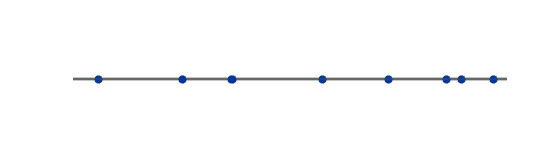
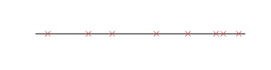

# myplot_point

##### Plotting point process on a time line

#### Depends on:
* my matlab utility function [mycolor](https://github.com/weitingwlin/matlabutility/blob/master/documents/mycolor.md), [myplot](https://github.com/weitingwlin/matlabutility/blob/master/documents/myplot.md), [myplot_vec](https://github.com/weitingwlin/matlabutility/blob/master/documents/myplot_vec.md)

## Syntax

### h = myplot_point(events, type, color, linecolor)

*  **events**: a vector of time points at whitch the events happen
*  **type**:style of events plotted
   + 'S': plot as points, the default
   + 'X': plot as X (crosses)
   + 'L': plot as vertical lines (or 'rods', 'spikes') 
* **color**: color \* of the event markers, default: 3 (dark blue)
* **linecolor**: color \* of the time line, default: 7 (gray)

#####\*color: Vector (length = 3), [RGB tripletcode for colors](http://www.mathworks.com/help/matlab/ref/colorspec.html?searchHighlight=colors). Or an interger, select a color from **mycolors**. (To see color plate, type `mycolor`, or [check the document](https://github.com/weitingwlin/matlabutility/raw/master/documents/images/mycolor_2.png).)

## Example: 
### The default plot

		 X = sort(rand(10,1)); % mock data
         myplot_point(X);
  
### Plot with X
And change event marker to red (code: 2).

		myplot_point(X, 'X', 2); 
  
### Plot with line, spikes
Change time line to black (code: 1).
And add x label, y label.

		myplot_point(X, 'L', 2, 1); 
		xlabel('time');ylabel('events')
  