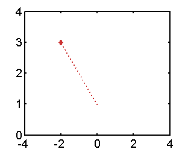

# myplot_vec

##### Plotting out a 2D vector. Or drawing a line between two points. 

##### Put text on the proper location.

## Syntax

### [h1, h2] = myplot_vec(a, b,textin,color,Lstyle, Pstyle);

*  **a, b **: scalers or vectors specifying the vector to plot.
 +  if they are scalers, **[a,b]** is the vector
 +   if they are vectors (length=2), vector is from point **a** to point **b**  
*  **textin**:the text to be put on the end (where b is); default is []
* **color**: the color input be passed to function [myplot](https://github.com/weitingwlin/matlabutility/blob/master/documents/myplot.md); to see the colorplate type `mycolor` in command window.
* **Lstyle, Pstyle**: the style argument of the line and the point, will be passed to function [myplot](https://github.com/weitingwlin/matlabutility/blob/master/documents/myplot.md).
  + Default for **Lstyle** is 1 or '-'.
  + Default for **Pstyle**: is not to draw the end point. 

## Example: 
### Drawing vectors
Draw a vector (from origin [0,0]):

		myplot_vec(sin(1),cos(1))
        	% set axis   
        	  axis( [-1 1 -1 1]); 
        	 
   

Draw a vector from point [0,1] to point [-2,3].

* No text to print (textin = [])
* Set color red (color = 2 ;see [mycolor](https://github.com/weitingwlin/matlabutility/blob/master/documents/mycolor.md) for detail)
* Dashed line (Lstyle = ':')
* Dimond at the endpoint (Pstyle = 2)

        myplot_vec([0, 1],[-2 3], [], 2, ':' , 3); 
            % set axis  
       		  axis( [-4 4 0 4]);

   

### Displaying texts
Texts will be printed on the outer side of the vector. 

     % plot 3 vectors 
     myplot_vec(0.5, 0.5,'vec1'); 
     myplot_vec(-0.6,0.3,'vec2'); 
     myplot_vec(0.1,-0.3,'vec3'); 
     	% set axis
     	  axis( [-1 1 -1 1]); 
        % draw reference lines with my function 
          hline; vline
   