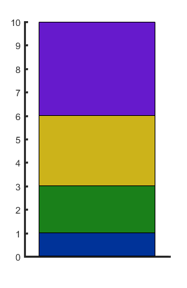
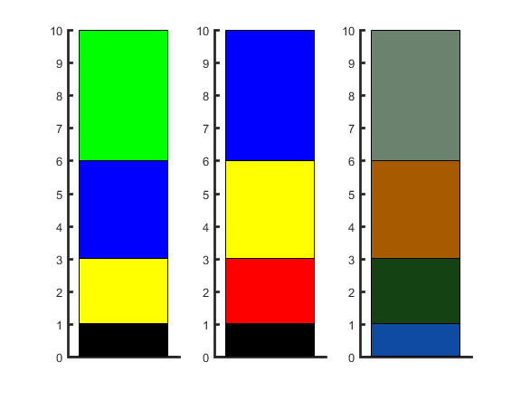
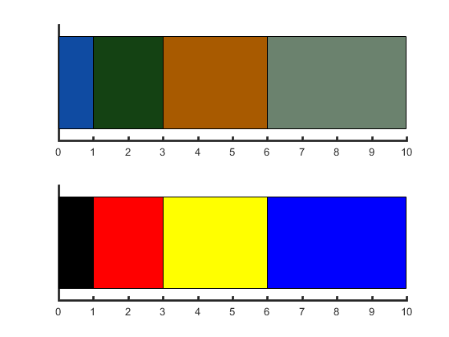
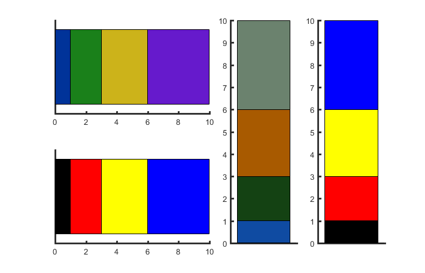

# mystackbar

##### Make a single stacked bar graph (somehow it doesn't work with the built in function `bar`); can be an alternative to pie chart.

## Syntax

###  h = mystackbar(v, colors, direction)

*  **v**: the vector to plot
*  **colors**:the color (code, rgb, or letter)
    + default is colors from [my color plate](https://github.com/weitingwlin/matlabutility/blob/master/documents/mycolor.md)
*  **direction**: direction of the bar
   + 'v': or 1, vertical, the default
   + 'h': or 2, horizontal     

  

## Example: 
	v = [1 2 3 4];

### The default

		mystackbar(v)

   

### Using colors
 	
	figure
    subplot(1,3,1)
		mystackbar(v, [0 0 0 ;1 1 0; 0 0 1; 0 1 0]);
    subplot(1,3,2)
    	mystackbar(v, ['k'; 'r';'y'; 'b'])  ;
	subplot(1,3,3)
    	mystackbar(v, [21 22 23 24]);

   

### Horizontal

	figure
    subplot(2,1,1)
		mystackbar([1 2 3 4], [21 22 23 24], 2);
	subplot(2,1,2)
    	mystackbar([1 2 3 4], ['k'; 'r';'y'; 'b'], 'h');

   

### other example

    figure
    subplot(2,4,[1 2])
		mystackbar(v, [], 'h');
    subplot(2,4,[5 6])
    	mystackbar(v, ['k'; 'r';'y'; 'b'], 'h')  ;
    subplot(2,4,[3 7])
    	mystackbar(v, [21 22 23 24]);
    subplot(2,4,[4 8 ])
        mystackbar(v, ['k'; 'r';'y'; 'b'])  ;    

(tip: use `mysubplot(2,4)` to see [how to compose subplots](https://github.com/weitingwlin/matlabutility/blob/master/documents/mysubplot.md#display-cell-id).)

  