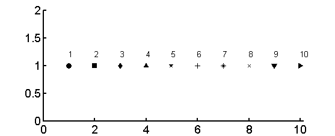
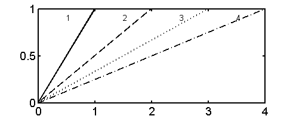
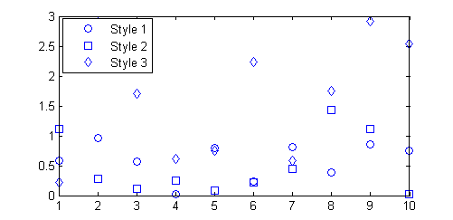

# mystyle

##### Specify a plotting style by number. Used in other function (myplot)

##### Also display the style sheet.

#### Depends on:
* my matlab utility function [myplot](https://github.com/weitingwlin/matlabutility/blob/master/documents/myplot.md) 

## Syntax

###  out = mystyle(stylecode, type)

*  **stylecode**: numeric, specifier. 
   + 1~10 for scatter plots; 1~4 for lines. 
   + 0 for displaying the "plate" in a new figure
   + If the input is **'S'** or **'L'**, this value passed to **type**, and display the assigned "plate". 
*  **type**:optional, type of plots. Style correspond to types. 
   + 'S': scatter plot; the default
   + 'L': line

## Example: display the "plate"

The function **myplot** recognize numerics specifier as input style (See document of [myplot](https://github.com/weitingwlin/matlabutility/blob/master/documents/myplot.md) for detail). This function serve to display the style sheet for reference while coding with **myplot**.

### Plate for marker styles
    mystyle
Note that this equals to `mystyle(0,'S')` or `mystyle(0)`

   

### Plate for line styles

    mystyle('L')

Note that this equals to `mystyle(0,'L')` 

   

## Example: use in plots

Useful in a **for** loop.

      
      for i=1:3
      		plot(1:10,rand(1,10)*i,mystyle(i)); hold on
      end
      legend('Style 1', 'Style 2','Style 3')

   

## Example: use in [myplot](https://github.com/weitingwlin/matlabutility/blob/master/documents/myplot.md)
In the function **myplot**, the argument **style** (the 5th argument) can take both character or number. Using the same style sheet. See document of [myplot](https://github.com/weitingwlin/matlabutility/blob/master/documents/myplot.md) for detail.

    rng(1); 
	for i = 1:4
    	myplot([0 i],[0 1], 'L',i+7,i); hold on
	end

Note that `myplot(x,y,'S',1, i)` do the same thing as `myplot(x,y,'S',1, mystyle(i,'S'))`.

  

