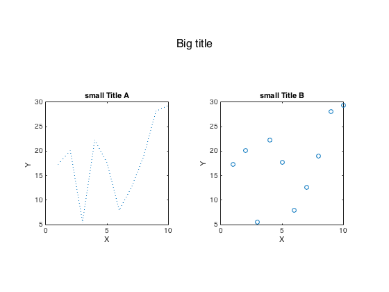
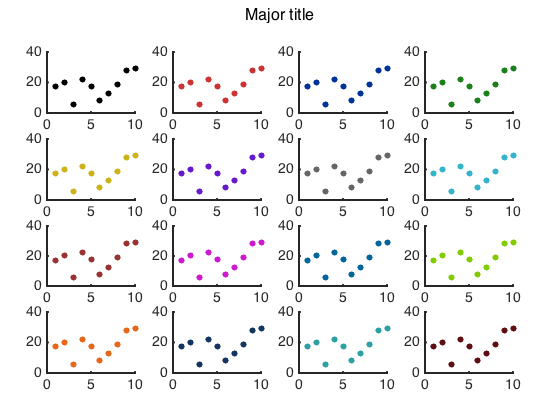
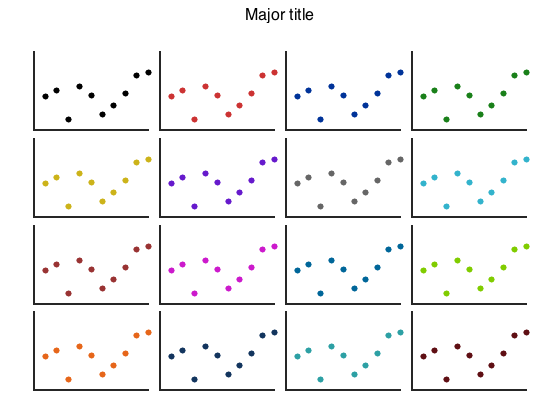
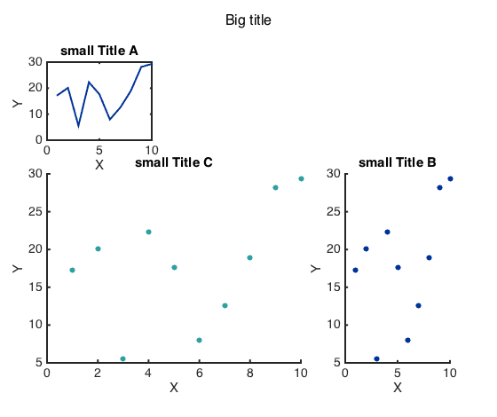
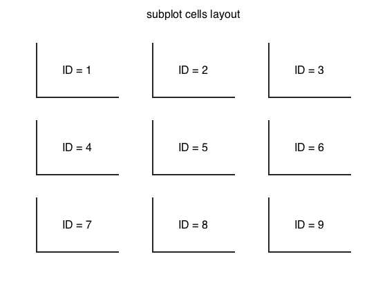

# mysubplot

##### Create subplots with Major title

##### Similar to `subplot`, but can add a major title on top. Can change the size of padding between subplots

Depends on [myplot](https://github.com/weitingwlin/matlabutility/blob/master/documents/myplot.md), [mycolor](https://github.com/weitingwlin/matlabutility/blob/master/documents/mycolor.md)

## Syntax

### mysubplot(L, W, ID, bigtitle, tightL, tightW)

*  **L, W**: the dimension of subplots as in `subplot(L,W,ID)`; 
 + to make larger subplot, make [ID] a vector with IDs of multiple cells.
 + to make mojor title, set ID = 0
*  **ID**: The location of subplot as in `subplot(L,W,ID)`
*  **bigtitle**: string of the major title; be ignored when ID ~= 0. (can put `[]` as place holder)
*  **tightL, tightW**: How tight the subplots packed, on the first and secand dimension. Or the ratio of space between subplots to the size of subplot. 
	+ Default : 0.3, 0.3  
	+ be ignored when ID = 0 (making major title)   

#### To make subplot: `mysubplot(L, W, ID, [], tightL, tightW)`

use the first 3 arguments like in matlab function `subplot`.  

#### To make major title: `mysubplot(L, W, 0, bigtitle)`

use the first 2 arguments like in `subplot`, but set `ID` = 0.

#### To print subplot cell layout
`mysubplot(L, W)`

## Example: 
#### Making mock data
    X = [1:10];
    Y = [1:10]+rand(10,1)'*20';
    
### Subplots with major title
Making major title by setting ID = 0, and the string after

    figure
    % making major title
        mysubplot(1,2,0,'Big title')

And make the subplots as in `subplot`
        
    % making subplots
        mysubplot(1,2,1)
            plot(X,Y,':')
            xlabel('X');ylabel('Y ')
            title('small Title A')
        mysubplot(1,2,2)
            plot(X,Y,'o')
            xlabel('X');ylabel('Y')
            title('small Title B')
   
 
### Another example: adjust paddings
This and later examples here use [myplot](https://github.com/weitingwlin/matlabutility/blob/master/documents/myplot.md), a function makes pretty plots more quickly, and [mycolor](https://github.com/weitingwlin/matlabutility/blob/master/documents/mycolor.md), select color more easily.

	figure
   		mysubplot(4,4,0, 'Major title')
	for i = 1:16
    	mysubplot(4,4,i)
    	myplot(X,Y, 'S', i);
	end

  

#### Shrink padding size 
You can pack subplots more tightly by adjusting the size of paddings. (Note I put a `[]` at where bigtitle should be as place holder.)

    figure
 		mysubplot(4,4,0, 'Major title')
	for i = 1:16
   	 	mysubplot(4,4,i, [], 0.1, 0.1)
    	myplot(X,Y, 'S', i);
    	set(gca,'xtick',[]) % remove x ticks
    	set(gca,'ytick',[])
	end
	
  	
	
### Example of merging cells
You can merge multiple cells to make a larger subplot, do so by putting ID**s** of the cells in `ID`

    figure
    % making major title 
        mysubplot(3,3,0,'Big title')
    % making subplots
        mysubplot(3,3,1)
            myplot(X,Y,'L')
            xlabel('X');ylabel('Y ')
            title('small Title A')
    % making subplots of different sizes by merging cells 
        mysubplot(3,3,[6 9])
            myplot(X,Y,'S')
            xlabel('X');ylabel('Y')
            title('small Title B')          
        mysubplot(3,3,[4 5 7 8])
            myplot(X,Y,'S',15)
            xlabel('X');ylabel('Y')
            title('small Title C')
   
  
         
If your input IDs will not make a square, error will occur.
         
    mysubplot(2,2,[2 3])
    
### Display Cell ID    
Leaving `ID` empty, `mysubplot(L,W)` will display a layout of subplot cells. Making it easier for you to make subplot of different sizes.

	mysubplot(3,3)
	
  

You can also check the [document of subplot](http://www.mathworks.com/help/matlab/ref/subplot.html) for how the cells are IDed.