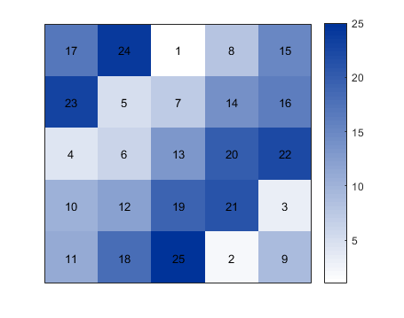
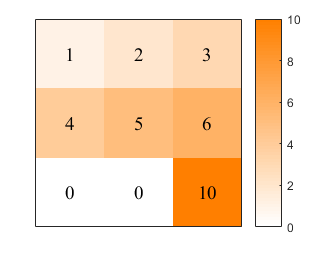
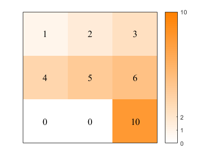

# mytable

##### Print matrix and color code the values

##### depends on 
* my matlab utility function [mycolor](https://github.com/weitingwlin/matlabutility/blob/master/documents/mycolor.md), [mycolormap](https://github.com/weitingwlin/matlabutility/blob/master/documents/mycolormap.md), mytext

## Syntax

###  [im, hcb] = mytable(A, fullcolor, fsize, fname);

*  **A**: The matrix to print
*  **fullcolor**: the color of the full scale. Will be passed to function `mycolormap`. Default is blue (`3`).
* **fsize**: font size; default is `10`
* **fname**: font name ('FontName' argument passed to function `text`); default is ` 'Helvetica'`

* [im, hcb]: handles of image and color bar.

## Example:
 
#### Print a magic square

	mytable(magic(5));

  

#### Change color, font size, font style

 	A = [1 2 3 ; 4 5 6; 0 0 10]
  	[im, hcb] = mytable(A, 'orange', 14, 'Times New Roman'); 

  

#### Using handle to change alpha, color bar
 
	set(hcb,'YTick', [0 1 2 10]);
	im.AlphaData = 0.8;

  