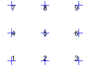
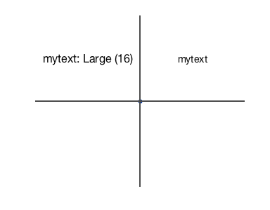
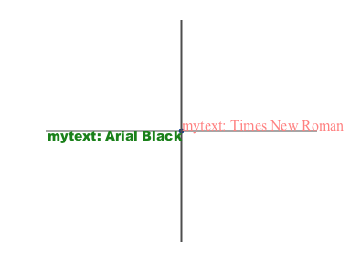
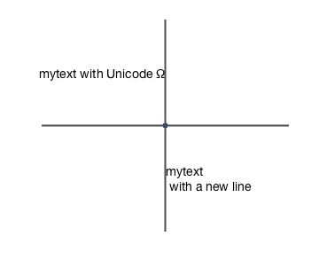

# mytext

##### Facilitate the use of `text` function

## Syntax

### mytext(x, y, textin, fsize, Halign, Valign, textcolor, fontname)

### mytext(x, y, textin, fsize, align_code, [], textcolor, fontname)

*  **x, y**: x, y coordinates passed to `text`
*  **textin**: the text (in "") content passed to `text`. The `textin` will be transformed by `sprintf` function, so expressions like `\n`, `\t`, and **Unicode** will work.
*  **fsize**: FontSize
	+ default: 12
*  **Halign**: the `HorizontalAlignment` 
	+ can also take 'c'/'C', 'l'/'L', or 'r'/'R' as short hands (for 'centre', 'left', 'right').
	+ default: 'center'
*  **Valign**: the `VerticalAlignment` 
	+ can also take 'm'/'M', 'b'/'B', or 'c'/'C'/'t'/'T' as short hands (for 'middle', 'baseline', 'cap'/'top'). 
	+ default: 'middle' 
*  **align_code**: a short hand for alignment. 
	+  e.g. align_code = 1 means aligning 'left' and 'baseline'. 
	+ ref. type `mytext` to view the reference chart. (Also see the number keyboard)

	 
	+ put a place holder `[]` at the next position so the next two argument will be read correctly.
* **textcolor**: an integer (select from [mycolor](https://github.com/weitingwlin/matlabutility/blob/master/documents/mycolor.md)) or a 3-number rub color code.
* **fontname**: font of the text. 
	+ default: 'Helvetica'
	+ tip: use ` listfonts` to see available font name

  

## Example: 

### Default usage, changing font size
   
    % create plot and reference lines 
 		myplot(0,0);hold on; hline; vline; axis off
 		
	 % default used just as `text`
		mytext(0.5, 0.5, 'mytext')
	
	 % change font size
 		mytext(-0.5, 0.5, 'mytext: Large (16)', 16)
 		
  	
 		
### Change alignment, font and colour
   
    % create plot and reference lines 
 		myplot(0,0);hold on; hline; vline; axis off
 		
    % change font to 'Arial black', colour red (the code is 4),align 'right' and 'cap' (the align_code is 9)
 		mytext(0, 0 , 'mytext: Arial Black', [], 9, [], 4,'Arial Black')
 		
 	 %   
 		mytext(0, 0 , 'mytext: Times New Roman', 16, 'L', 'B', [1 0.5 0.5], 'Times New Roman')
 
   
  
### using `sfprint` and Unicode   
    % create plot and reference lines 
 		myplot(0,0);hold on; hline; vline; axis off
 		
 	 % `\n` for a new line
 	    mytext(0, -0.5, 'mytext\n with a new line', [], 4)  
 	    
 	 % Use `\xN` for hexadecimal Unicode, or \N for octal 
       mytext(0, 0.5, 'mytext with Unicode \x03A9', [], 6)

 
     
## References:
* [Unicode characters](https://unicode-table.com/en/#basic-latin)
* [another Unicode reference](http://www.rapidtables.com/code/text/unicode-characters.htm)
* [Matlab `sprintf`](https://www.mathworks.com/help/matlab/ref/sprintf.html#inputarg_formatSpec) 