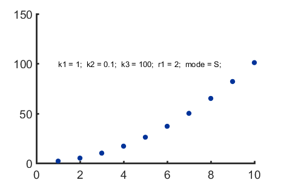
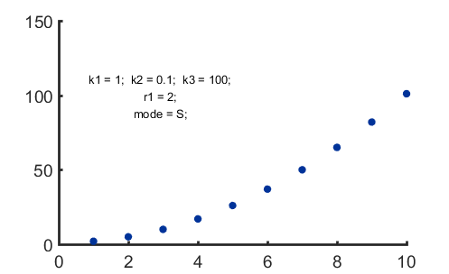

# Para2str

##### Return string(s) with parameter name and value. 

## Syntax

### out = para2str(A, B, C, ...)

### out = para2str(A, B, C, ..., [L1, L2,...])   

*  **A, B, C,...**: parameters with values to print
*  **[L1, L2, ...]**: the last input argument, should be un-named, assigne the number of parameters put in each line. Default is to print all parameters in one line.

## Example: 

Save this parameters in the workspace

	k1 = 1; k2 = 0.1; k3 = 100; r1 = 2; mode = 'S';

#### Return one parameter value as string:

	 str1 = para2str(k1)

str1 =

k1 = 1 

#### Return multiple parameters in a cell array of string:

The output cell array of string is most useful in plots

      str2 = para2str(k1, k2,k3, r1, mode)
      myplot( 1:10, [1:10].^r1 + k1 );  
      text(1,100, str2) 

     
    
#### Multi-line strings

Use the last argument to assign the number of elements in each line.

		str3 = para2str(k1, k2,k3, r1, mode, [3,1,1]);
        myplot( 1:10, [1:10].^r1 + k1 );
        text(3,100, str3, 'Horizontalalignment', 'Center')

(tip: modify output layout with `'Horizontalalignment'` )

     