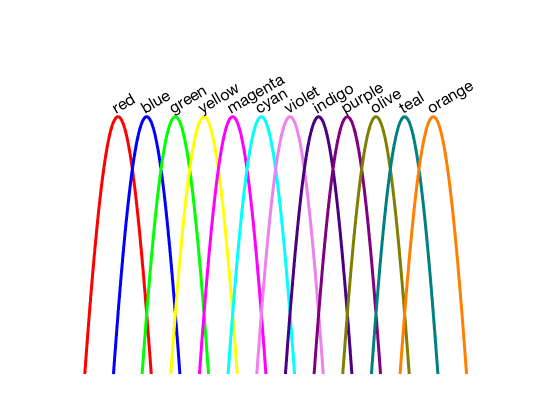

# str2rgb

##### Convert color name (in string) to rgb code

## Syntax

### rgbcode = str2rgb(c)

*  **c**: the string 
*  **rgbcode**: 
  
### colorlist = str2rgb()

(without input argument, the function print the available color and names in a figure)

* **colorlist**: the list of available names

## Example: 

#### print the available color and names

       str2rgb()

   