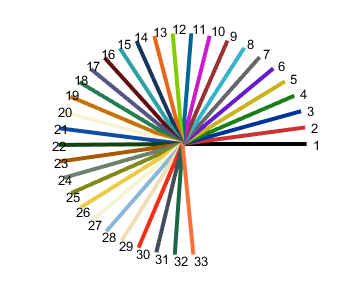
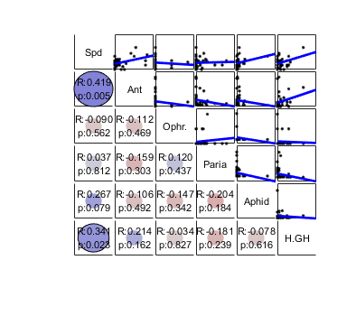
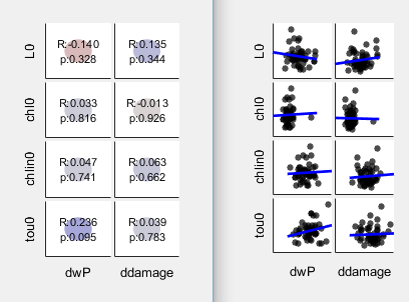
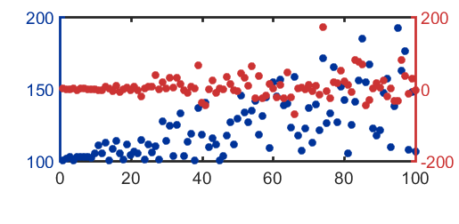

# Catelog

## Ecology data analysis and modeling

Functions used in ecological data analysis and modeling. e.g. community analysis, biodiversity calculation.

* **aggregation.m** : Indices for inter- and intra-species aggregation.(ref. Sevenster, 1996) 
* **association\_ind.m** : calculate association index
* **association\_ind\_bstr.m** :  calculate association index and bootstrap analysis
* **association\_ind\_bstr\_par.m** :  calculate association index and bootstrap analysis, accelerate using **parfor**
* **colonization.m** : calculate colonization rate from time series data.
* **beta_NES.m** : beta-diversity of different kind 
* **bio_diversity.m** : calculate biodiversity indices
* **bitemark.m** : transform bite mark count to estimated number of bite (where multiple bite cannot be distinguished).
* **bray_curtis.m** : 
* **checkerboard.m** : creating checkerboard landscape
* **disp_incidence.m** : simulate dispersal events (ref. Hanski & Woiwod, 1993)
* **explore_ttest.m** : transform data and do t-test
* **fisher_alpha.m** : Fisher's alpha, the diversity index
* **numInteraction.m** : Calculate numeric interaction from time series data of two populations.
* **numInteraction_bootstrap.m** : calculate CI and median for null model of the result in **numInteraction.m** using bootstrap.
* **plotTaylorFit.m** : function to fit Taylor's power law, and make plot.
* **TaylorFit.m** : function to fit Taylor's power law in community data.
* **work_bitemark.m** : Working and demo of function **bitemark**. 
 
## Making figures

Function related to making figures.

* **auto_tick.m** : calculate tick mark location, used in other functions. 
* **hline.m** : draw horizontal line
* **mycolor** : function, pick color from a color plates, used in many plotting functions.
>
  

* **mycorrplot_1** : Plot the results of correlation (i.e. corr(X)) in a figure with table-like structure.
>

* **mycorrplot_2** : Plot the results of correlation (i.e. corr(X, Y)) in figures with table-like structure.
>

* **myplot** : make nice(r) scatterplot or line plot quickly
* **myplot_bar** :  make nice(r) barplot quickly
* **myplot_CI** : make plot to show data and canfidence interval 
>

* **myplot_ls** : Make scatter plot and ls line
>
 

* **myplot_vec**: plotting 2D vector
>
 

* **myplotyy** : make nice(r) plotyy quickly
>
 

* **mysubplot** : Make subplot and add major/big title to the figure
>

* **plot_circle** : eazier way to make a circle
* **plot_square** : Make a square or box by imput x and y points

## Statistics utility and data handling 

Functions related to statistics and data analysis.

* **castdata.m** : put vector data into a matrix by assigned group
* **covcc.m** : column by column covarience for two matrices.
* **groupmean.m** : calculate mean using **accumarray** but more control.
* **hotellingT2.m** :  multivariate t-test with Hotelling's T-square
* **inlier.m** : function, remove outliers from vectors

* **meltdata** : Put each data in a matrix as a variable in a row ("an obseervation"), column id and row id as two other variables 
* **nancorr.m** : calculate correlation coefficient, ignore NaN in each pair
* **nangeomean.m** : calculate geometric mean with NaN removed. 
* **nanls.m** :  calculate ls parameters and r, p vlaue for correlation
* **nanzscore.m** : z-transform with NaNs. (remove NaN and pass parameters to matlab function **zscore**)
* **num2month** : return month string given number 1~12
* **randeval.m** : simulate and make histogram of argument
* **subset.m** : subset in a function 
* **tcastdata** : put data from table into a matrix by assigned group
* **tnames.m** : show names of variable in a table
* **thead.m** : show first few lines of table data
* **tri2line.m** : grab upper triangle of a (symatric) matix to a vector
* **vmeanSE.m** : calculate and display mean and SE from a vector

## Setup
* **work_setup.m** : this m-file set working directory to this mfiles folder. Can be a template for working with multiple machines.

---
## Reference
>Hanski & Woiwod (1993) Spatial synchrony in the dynamics of moth and aphid populations

>Sevenster (1996) Aggregation and Coexistence. I. Theory and Analysis

